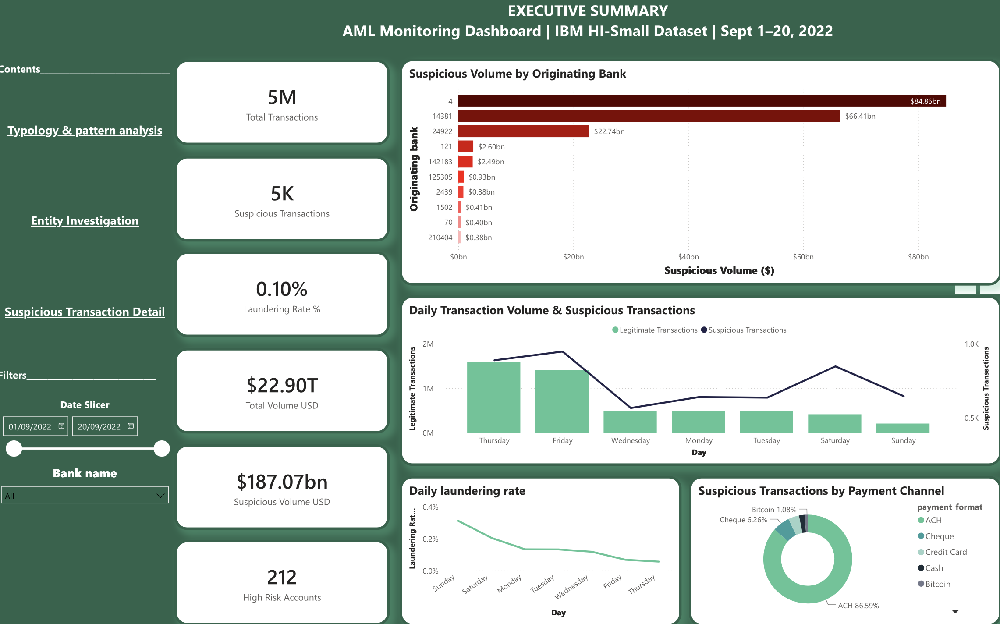
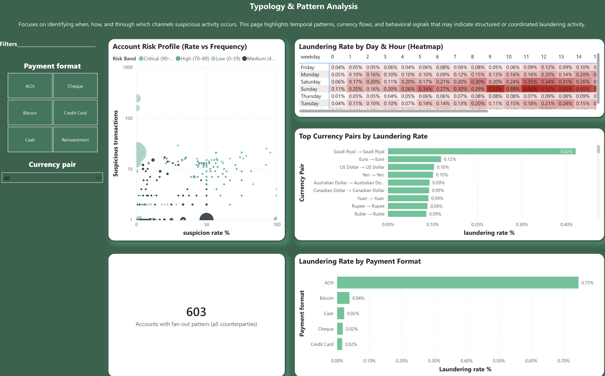
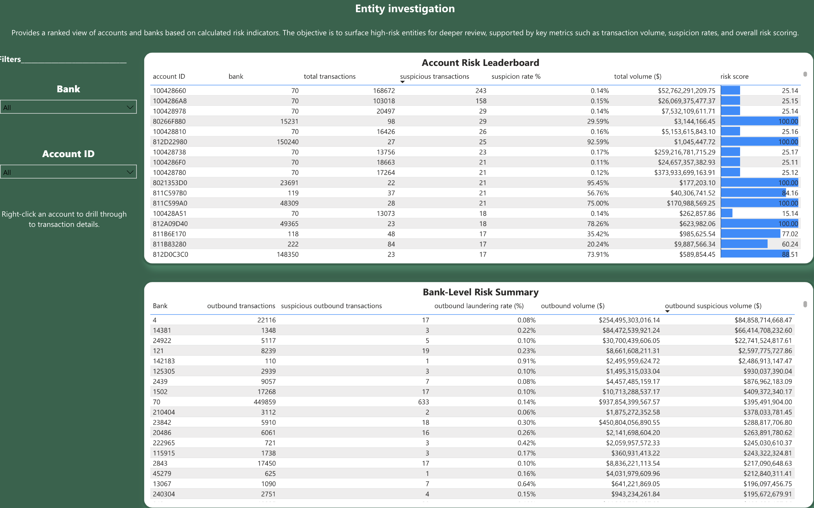
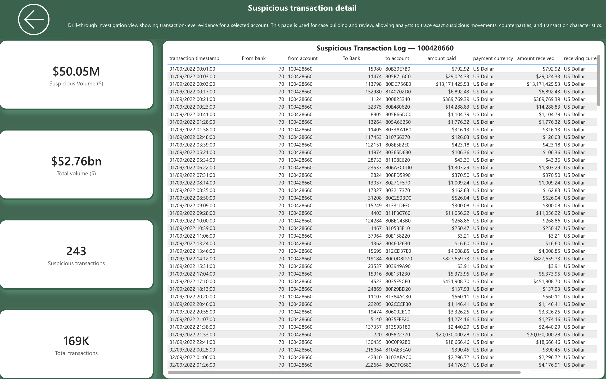

AML Transaction Analysis — IBM HI-Small Dataset

Overview

A financial crime analytics pipeline built to detect and visualise money 
laundering patterns in a synthetic transaction dataset. The project 
replicates the analytical workflow of a GRC or Compliance Analyst.

Dataset: IBM HI-Small (5,000,000 transactions | Sept 1–20, 2022 | 0.10% laundering rate)  
Stack: DuckDB → Power BI Desktop

---

Dashboard Preview

 Executive Summary

 Typology & Pattern Analysis

 Entity Investigation

 Suspicious Transaction Detail

---

 Key Findings

- Laundering rate: 0.10% of all transactions (5K out of 5M)
- Highest risk payment format: ACH — 0.75% laundering rate vs 0.10% average
- Highest risk currency pair: Saudi Riyal → Saudi Riyal at 0.42%
- Peak suspicious activity: Sundays across mid-day hours (heatmap analysis)
- Pass-through accounts detected: 603 accounts with fan-out pattern (≥5 counterparties)
- High risk accounts identified: 212 accounts with risk score ≥ 75
- Bank with highest suspicious volume: Bank 4 — $84.86bn suspicious outbound

---

 Pipeline
IBM HI-Small CSV (5M rows)
↓
DuckDB — Fast import + SQL analytics + Cache table creation
↓
Power BI — 4-page compliance dashboard (CSV import from DuckDB exports)
↓
GitHub — Portfolio delivery

Skills Demonstrated

- Data Engineering: 5M row CSV import into DuckDB with type casting and cache table architecture
- SQL Analytics: Typology detection queries, entity risk scoring, aggregation patterns
- Data Visualisation: 4-page Power BI dashboard with drill-through, DAX measures, conditional formatting
- Financial Crime Knowledge: AML typologies, regulatory context, SAR-ready investigation views
- Documentation: Full reproducibility guides for technical and non-technical audiences

